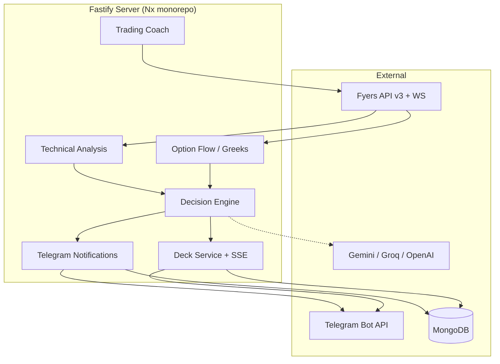

# Optra Pulse Bot

An Indian index options trading copilot for NIFTY, BANKNIFTY, and related indices. Optra combines multi-timeframe price action, option-flow analytics, and a conviction-based decision engine — delivered primarily through **Telegram alerts** and the **Optra Deck** (a Telegram Web App for live charts and drill-down).

Built for active intraday and swing options traders who use **Fyers** as their broker.

---

## What It Does

| Layer | Purpose |
|-------|---------|
| **Decision engine** | Blends price action + option flow into a single conviction score, action (CE-BUY / PE-BUY / NO-TRADE), and strategy recommendations |
| **Telegram bot** | Real-time signal alerts, 25+ slash commands, pre-session briefs, end-of-day coaching, TP nudges |
| **Optra Deck** | Mobile-friendly visual dashboard opened from Telegram — live SSE stream, charts, veto breakup, position view |
| **Trading coach** | Replays your actual Fyers fills with candle context and grades entries/exits |
| **AI beta** | Optional Gemini / Groq / OpenAI overlay that can adjust conviction (shadow or live mode) |

---

## Architecture



### Signal flow (simplified)

1. **Poll** — Every ~60s (configurable), the bot fetches technical analysis + option metrics for watched symbols/styles.
2. **Decide** — The decision engine computes conviction, applies veto/flow modes, momentum decay, and optional AI beta.
3. **Alert** — On confirmed signal changes, Telegram sends formatted alerts (full or compact).
4. **Drill down** — Tap the Deck button in alerts for live charts, component scores, veto breakup, and position management advice.
5. **Coach** — After market close, auto-sends a session summary; `/coach` replays individual trades on demand.

---

## Features

### Decision & analysis

- **Multi-timeframe price action** — 5m, 15m, 1h structure: FVG, order blocks, ATR/ADX, support/resistance, chart patterns
- **Option flow scoring** — OI, IV regime, Greeks, PCR, trend, dealer positioning
- **Trading styles** — Scalper (5m), Intraday (15m), Positional (1h) with style-specific weights and conviction thresholds
- **Flow modes** — `blend` (default), `pa` (price action only), `option` (option flow only)
- **Veto modes** — `strict`, `relaxed`, `off` — control how chart vetoes gate signals
- **Position awareness** — Detects open Fyers positions and surfaces management advice instead of blind entry prompts
- **Strike selection** — Exact strike recommender with Greeks/moneyness insights (`/beststrike`)

### Telegram experience

- **Auto alerts** — Signal flips, pattern breakouts, TP approach, hold nudges
- **Pre-session learning** — 09:00–09:20 IST brief based on recent trade habits
- **End-of-day coach** — Post-15:30 IST session wrap
- **Voice personalities** — Trader (EN), Simple (HI), Tapori (Hinglish), Marathi
- **Paper scoreboard** — Tracks how past alerts would have performed (`/outcomes`)

### Optra Deck

- Live SSE stream with conviction gauges, component breakdown, veto dock
- Multi-TF spot charts (Lightweight Charts)
- Replay mode for historical sessions
- Telegram Web App auth (initData validation)
- Tabs: Signal · Components · Veto · Strategy · Open · Adjust · Chart · Events

---

## Prerequisites

- **Node.js 20** (see `.nvmrc`)
- **Fyers API app** — [Fyers API dashboard](https://myapi.fyers.in/)
- **Telegram bot** — Create via [@BotFather](https://t.me/BotFather)
- **MongoDB** — Atlas or self-hosted (persists tokens, snapshots, preferences, outcomes)

---

## Quick Start

```bash
# Clone and install
git clone <repo-url>
cd optra-pluse-bot-server
nvm use          # Node 20
npm install

# Configure environment variables (see tables below)
# e.g. export FYERS_API_KEY=... TELEGRAM_BOT_TOKEN=... MONGODB_URL=...

# Development
npx nx serve @optra-pulse-bot/server

# Production build + run
npm run build
npm start
```

Server listens on `http://0.0.0.0:3000` by default. Health check: `GET /api`.

---

## Environment Variables

### Required

| Variable | Description |
|----------|-------------|
| `FYERS_API_KEY` | Fyers app ID |
| `FYERS_API_SECRET` | Fyers app secret |
| `FYERS_REDIRECT_URL` | OAuth redirect — must point to `{PUBLIC_APP_URL}/api/access-token` |
| `PUBLIC_APP_URL` | Public base URL of this server (used in login links) |
| `MONGODB_URL` | MongoDB connection string |
| `TELEGRAM_BOT_TOKEN` | Bot token from BotFather |
| `TELEGRAM_CHAT_ID` | Default chat for alerts |

### Telegram

| Variable | Default | Description |
|----------|---------|-------------|
| `TELEGRAM_NOTIFICATIONS_ENABLED` | `true` | Master switch for polling + alerts |
| `TELEGRAM_ALLOWED_USER_IDS` | falls back to chat ID | Comma-separated Telegram user IDs allowed to run commands |
| `TELEGRAM_NOTIFY_SYMBOLS` | `NSE:NIFTY50-INDEX` | Comma-separated symbols to watch |
| `TELEGRAM_NOTIFY_STYLES` | `INTRADAY` | Comma-separated styles: `SCALPER`, `INTRADAY`, `POSITIONAL` |
| `TELEGRAM_POLL_INTERVAL_MS` | `60000` | Signal poll interval |
| `TELEGRAM_PRE_SESSION_LEARNING_ENABLED` | `true` | 09:00 IST learning brief |
| `TELEGRAM_LEARNING_LOOKBACK_DAYS` | `10` | Days of trades for `/learning` insights |
| `TELEGRAM_MARKET_NEWS_ENABLED` | `true` | Enable `/news` RSS fetch |
| `TELEGRAM_MARKET_NEWS_RSS_URL` | — | Override default news RSS feed |

### AI (optional)

| Variable | Default | Description |
|----------|---------|-------------|
| `ACTIVE_AI_PROVIDER` | `GEMINI` | `GEMINI`, `GROQ`, `OPENAI`, or `XAI` |
| `GEMINI_API_KEY` | — | Google Gemini |
| `GROQ_API_KEY` | — | Groq |
| `OPENAI_API_KEY` | — | OpenAI |
| `XAI_API_KEY` | — | xAI |

Toggle AI at runtime via `/ai` in Telegram (shadow vs live conviction adjustment).

### Deck

| Variable | Default | Description |
|----------|---------|-------------|
| `DECK_SSE_ENABLED` | `true` | Enable live SSE stream endpoint |
| `DECK_SSE_TICK_MS` | — | SSE tick interval |
| `DECK_FULL_REFRESH_MS` | — | Full payload refresh interval |
| `DECK_SKIP_TELEGRAM_AUTH` | `false` | Skip initData auth (dev only) |

### Market data & caching

| Variable | Default | Description |
|----------|---------|-------------|
| `FYERS_WS_ENABLED` | `true` (non-test) | Fyers WebSocket market stream |
| `FYERS_WS_LITE_MODE` | `true` | Reduced WS subscription set |
| `CANDLE_CACHE_TTL_5M_MS` | — | 5m candle cache TTL |
| `CANDLE_CACHE_TTL_15M_MS` | — | 15m candle cache TTL |
| `OPTION_CHAIN_REST_REFRESH_MS` | — | Option chain REST refresh interval |
| `OPTION_CHAIN_SNAPSHOT_INTERVAL_MINUTES` | — | Snapshot store interval |
| `OPTION_CHAIN_SNAPSHOT_RETENTION_DAYS` | — | Mongo TTL for snapshots |

### Server

| Variable | Default | Description |
|----------|---------|-------------|
| `HOST` | `0.0.0.0` | Bind address |
| `PORT` | `3000` | Listen port |
| `NODE_ENV` | — | `test` disables WS by default |

---

## Fyers OAuth Setup

1. Register an app at [Fyers API](https://myapi.fyers.in/) with redirect URL:
   ```
   https://<your-domain>/api/access-token
   ```
2. Set `FYERS_API_KEY`, `FYERS_API_SECRET`, `FYERS_REDIRECT_URL`, and `PUBLIC_APP_URL`.
3. Authenticate:
   - Browser: `GET /api/login?forceRedirect=true`
   - Telegram: `/login` (sends a link)
   - API: `GET /api/login` → open `redirectUrl` → Fyers redirects to `/api/access-token?auth_code=...`
4. Token is stored in MongoDB and reused until expiry (~24h). Alerts auto-resume after login.

Other Fyers endpoints: `/api/profile`, `/api/funds`, `/api/token-status`, `/api/logout`.

---

## Telegram Bot Setup

1. Create a bot with [@BotFather](https://t.me/BotFather) → copy `TELEGRAM_BOT_TOKEN`.
2. Start a chat with your bot; get your chat ID (e.g. via `@userinfobot` or the Bot API).
3. Set `TELEGRAM_CHAT_ID` and optionally `TELEGRAM_ALLOWED_USER_IDS` (comma-separated).
4. Deploy with `TELEGRAM_NOTIFICATIONS_ENABLED=true`.
5. The server registers slash commands automatically and uses long-polling for instant command pickup.

### Commands

| Command | Description |
|---------|-------------|
| `/now` | Live market recommendation |
| `/why` | Breakdown of the latest alert |
| `/coach` | Grade today's trades (Fyers tradebook replay) |
| `/learning` | Habits & leaks from recent trades |
| `/outcomes` | Paper scoreboard for past alerts |
| `/conviction` | Win-rate by conviction bucket |
| `/rr` | Risk/reward map (entry, stop, targets) |
| `/size` | Position sizing from balance + stop risk |
| `/beststrike` | Gamma blast + engine strike pick |
| `/news` | Market headlines |
| `/newsfeed` | Switch Google vs CNBC feed |
| `/style` | Scalper / intraday / positional |
| `/veto` | Chart veto mode (strict / relaxed / off) |
| `/flow` | PA-only / option-only / blend |
| `/voice` | Alert personality (EN / HI / Hinglish / Marathi) |
| `/alert` | Full vs compact alert format |
| `/ai` | AI agent settings |
| `/start` | Resume signal alerts |
| `/stop` | Pause alerts (TP still active) |
| `/status` | Bot health, polls, Fyers token |
| `/login` | Fyers session wake-up link |
| `/apiusage` | Fyers API consumption |
| `/clear` | Delete bot messages above command |
| `/help` | Full command cheat sheet |

**Auto pings (no command):** pre-session brief (09:00–09:20 IST) · signal flips · TP/hold nudges · end-of-day coach (after 15:30 IST).

---

## API Reference

All routes are served from the Fastify server. Most analysis endpoints require a valid Fyers session.

### Core analysis

| Method | Path | Description |
|--------|------|-------------|
| `GET` | `/api/trade-decision` | Full confluent decision — conviction, action, strategies, position context, AI beta |
| `GET` | `/api/technical-analysis` | Multi-TF price action, structure, levels, momentum |
| `GET` | `/api/score-metrics` | Option flow components, Greeks insights, IV regime |
| `GET` | `/api/technical-analysis/timeline` | Historical TA timeline for a session |
| `GET` | `/api/position-sizing` | Lot sizing from funds + stop risk |
| `GET` | `/api/trading-coach` | Trade replay + coaching verdicts from Fyers fills |
| `GET` | `/api/symbols/option-indices` | Supported index symbols (NIFTY, BANKNIFTY, FINNIFTY, …) |

**Common query params:** `symbol`, `tradingStyle` (`SCALPER` \| `INTRADAY` \| `POSITIONAL`), `vetoMode`, `flowMode`.

### Deck

| Method | Path | Description |
|--------|------|-------------|
| `GET` | `/deck/` | Optra Deck Web App (Telegram initData auth) |
| `GET` | `/api/deck/live` | Single live snapshot |
| `GET` | `/api/deck/stream` | SSE live stream |
| `GET` | `/api/deck/replay` | Historical session replay (`?date=YYYY-MM-DD`) |

### Auth & account

| Method | Path | Description |
|--------|------|-------------|
| `GET` | `/api/login` | Start Fyers OAuth (`?forceRedirect=true` for browser redirect) |
| `GET` | `/api/access-token` | OAuth callback (Fyers redirects here) |
| `GET` | `/api/logout` | Clear Fyers session |
| `GET` | `/api/token-status` | Token validity check |
| `GET` | `/api/profile` | Fyers profile |
| `GET` | `/api/funds` | Account funds |

### Notifications (admin)

| Method | Path | Description |
|--------|------|-------------|
| `GET` | `/api/notifications/status` | Poll loop health |
| `GET` | `/api/notifications/fyers-usage` | API rate-limit usage |
| `POST` | `/api/notifications/poll` | Trigger manual poll |
| `GET/POST` | `/api/notifications/test` | Send test alert |

---

## Supported Indices

| Label | Fyers symbol | Lot size |
|-------|--------------|----------|
| Nifty 50 | `NSE:NIFTY50-INDEX` | 65 |
| Nifty Bank | `NSE:NIFTYBANK-INDEX` | 30 |
| Nifty Financial Services | `NSE:FINNIFTY-INDEX` | 60 |
| Nifty Midcap Select | `NSE:MIDCPNIFTY-INDEX` | 120 |
| Nifty Next 50 | `NSE:NIFTYNXT50-INDEX` | 25 |
| S&P BSE Sensex | `BSE:SENSEX-INDEX` | 20 |
| S&P BSE Bankex | `BSE:BANKEX-INDEX` | 30 |

---

## Project Structure

```
apps/
  server/                          # Main Fastify application
    src/
      main.ts                      # Entry point
      app/
        plugins/                   # Core engines (decision, TA, Fyers, Telegram, AI, MongoDB)
        routes/                    # HTTP API routes (autoloaded)
        telegram-notifications/    # Alert formatting, commands, Deck builders, coaching
        technical-analysis/        # Patterns, volatility regime, session bias
        option-flow/               # Strike recommender, Greeks insights
        trading-coach/             # Fyers trade replay + verdicts
        position-sizing/           # Lot calculator
        market-data/               # WS stream, quote cache, option chain
        assets/deck/               # Optra Deck static Web App (HTML/CSS/JS)
  server-e2e/                      # E2E smoke tests
```

Built with [Nx](https://nx.dev) — Node 20, TypeScript, Fastify 5, Jest.

---

## Development

```bash
# Dev server with hot reload
npx nx serve @optra-pulse-bot/server

# Run unit tests (77 suites, 300+ tests)
npm run test:server

# Build + test
npm run verify

# Dependency graph
npx nx graph
```

### Code standards

Public exports use JSDoc (see `apps/server/GEMINI.md`). Match existing patterns: thin routes, logic in plugins/modules, heavy test coverage for decision and notification paths.

---

## Deployment

The repo includes a [Render](https://render.com) blueprint (`render.yaml`):

- **Build:** `npm install && npm run build`
- **Start:** `npm start` → `node apps/server/dist/main.js`
- **Health check:** `/api`

Set all required env vars in the Render dashboard. `MONGODB_URL`, Fyers secrets, and Telegram tokens are marked `sync: false` (manual).

---

## Disclaimer

Optra Pulse Bot is a **decision-support and alerting tool**, not financial advice. All signals, coaching, and sizing suggestions are for educational and personal use. Options trading involves substantial risk. Always apply your own risk rules and comply with applicable regulations.

---

## License

MIT